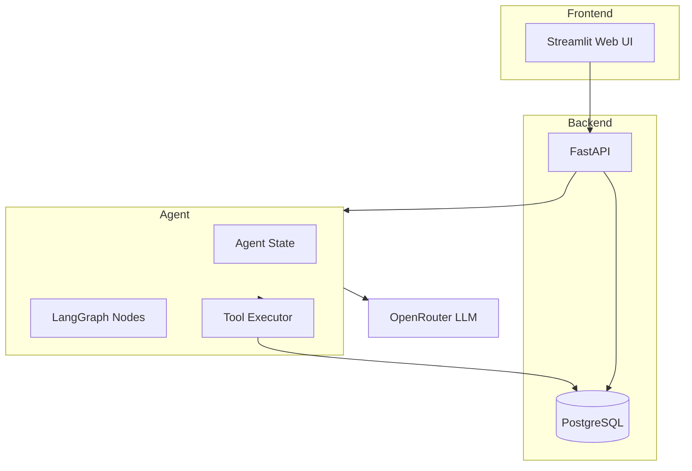
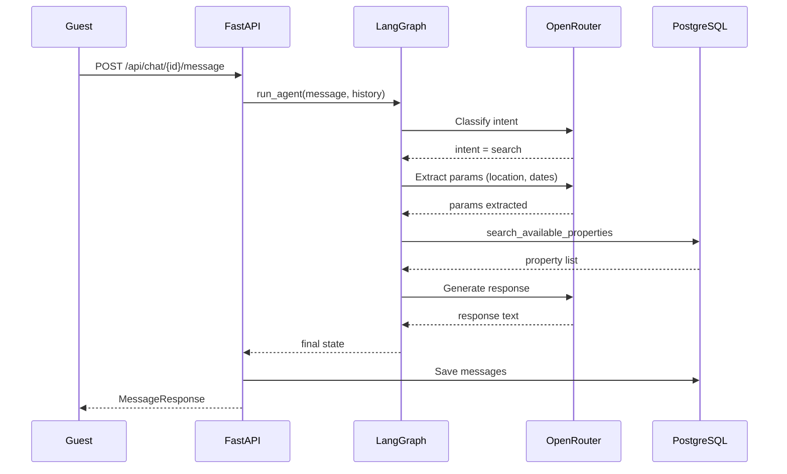
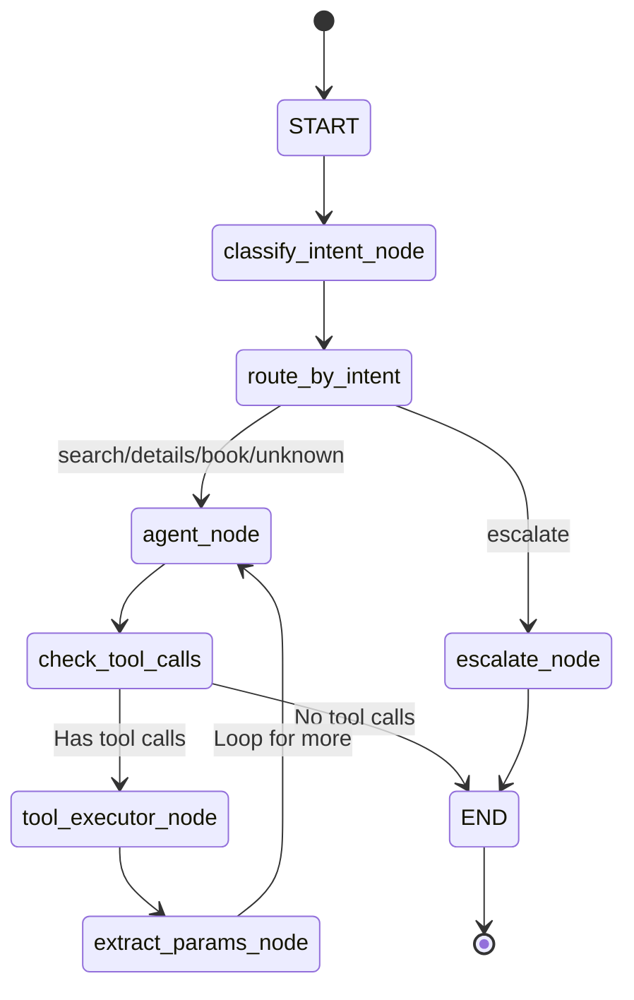

# StayEase AI Agent
  
> An AI-powered accommodation booking assistant for Bangladesh's short-term rental market.  
> Built with **LangGraph**, **FastAPI**, **PostgreSQL**, and **OpenRouter**.

---

## Table of Contents

1. [System Overview](#1-system-overview)
2. [Architecture](#2-architecture)
3. [Conversation Flow](#3-conversation-flow)
4. [LangGraph State Design](#4-langgraph-state-design)
5. [Node Design](#5-node-design)
6. [Tool Definitions](#6-tool-definitions)
7. [Database Schema](#7-database-schema)
8. [API Endpoints](#8-api-endpoints)
9. [Project Structure](#9-project-structure)
10. [Setup & Running](#10-setup--running)

---

## 1. System Overview

StayEase AI Agent is a conversational booking assistant for StayEase short-term rental platform in Bangladesh. Guests interact via natural language (Bengali or English) to:

- **Search** for available properties
- **View** property details  
- **Book** accommodations

The system uses a LangGraph state machine that classifies messages into intents and routes to appropriate tools. FastAPI backend persists conversation history to PostgreSQL.

---

## 2. Architecture



### Conversation Flow Diagram



---

## 3. Conversation Flow

**Example: Guest searches for properties**

| Step | Actor | Action |
|------|-------|--------|
| 1 | Guest | Sends message: "I need a room in Cox's Bazar for 2 nights for 2 guests" |
| 2 | FastAPI | Loads conversation history, calls `run_agent()` |
| 3 | classify_intent_node | Scans for keywords, detects "search" intent |
| 4 | agent_node | Calls LLM to extract params and execute search |
| 5 | search_available_properties | Queries PostgreSQL for available listings |
| 6 | extract_params_node | Parses results into state |
| 7 | agent_node | Generates response with property details |
| 8 | FastAPI | Persists messages to DB, returns response |

---

## 4. LangGraph State Design

```python
class AgentState(TypedDict):
    conversation_id: str           # DB key for history
    messages: list[BaseMessage]   # Full conversation
    intent: IntentType         # search|details|book|escalate|unknown
    location: str | None      # Extracted location
    check_in: str | None    # Check-in date
    check_out: str | None   # Check-out date
    num_guests: int | None   # Number of guests
    listing_id: str | None   # Selected property
    listing_details: dict | None  # Full listing info
    booking_id: str | None   # Confirmation ref
    booking_confirmed: bool   # Booking status
    search_results: list[dict]  # Search results
    error_message: str | None  # Error state
```

| Field | Rationale |
|-------|----------|
| `conversation_id` | Ties graph run to persistent DB row |
| `messages` | Full turn history for multi-turn reasoning |
| `intent` | Drives conditional routing |
| `location/check_in/etc` | Extracted once, reused across turns |
| `listing_id/details` | Cached to avoid repeat DB calls |
| `booking_id/confirmed` | Surfaced to API response |
| `search_results` | Available to book flow |

---

## 5. Node Design

### LangGraph Node Flow



### Nodes:

| Node | What | Updates | Next |
|------|------|---------|-------|
| classify_intent_node | Classifies user message into intent | `intent` | Router |
| agent_node | LLM reasoning, decides tool calls | `messages` | tool_executor or END |
| tool_executor_node | Executes tool functions | `messages` | extract_params_node |
| extract_params_node | Parses tool results into state | search_results, listing_details | agent_node |
| escalate_node | Generates handoff message | `messages` | END |

---

## 6. Tool Definitions

### Tool 1: search_available_properties
```
Input:
  - location: str (required) - City/area name
  - check_in: str (required) - YYYY-MM-DD
  - check_out: str (required) - YYYY-MM-DD
  - num_guests: int (required) - 1-20
  - property_type: str (optional) - apartment/cottage/resort/etc

Output: list of properties with id, title, price, capacity, amenities, rating

When: User wants to find accommodations
```

### Tool 2: get_listing_details
```
Input:
  - listing_id: str (required) - Property UUID

Output: Full property info (description, address, amenities, house_rules, cancellation_policy, host_name, host_phone)

When: User asks for more information about a property
```

### Tool 3: create_booking
```
Input:
  - listing_id: str (required)
  - guest_name: str (required)
  - guest_phone: str (required)
  - check_in: str (required) - YYYY-MM-DD
  - check_out: str (required) - YYYY-MM-DD
  - num_guests: int (required)

Output: booking_id, confirmation_message

When: User confirms booking with name and phone
```

---

## 7. Database Schema

### Table: listings
| Column | Type | Description |
|--------|------|------------|
| id | UUID | Primary key |
| title | VARCHAR(200) | Property name |
| description | TEXT | Full description |
| property_type | ENUM | apartment/cottage/resort/etc |
| location | VARCHAR(150) | City/area |
| address | VARCHAR(300) | Full address |
| price_per_night_bdt | INTEGER | Price per night |
| capacity | SMALLINT | Max guests |
| bedrooms | SMALLINT | Bedrooms |
| bathrooms | SMALLINT | Bathrooms |
| amenities | TEXT[] | Amenities list |
| rating | NUMERIC(3,2) | 0-5 rating |
| is_active | BOOLEAN | Available |

### Table: bookings
| Column | Type | Description |
|--------|------|------------|
| id | UUID | Primary key |
| listing_id | UUID | FK to listings |
| guest_name | VARCHAR(150) | Guest name |
| guest_phone | VARCHAR(20) | Contact phone |
| check_in | DATE | Check-in date |
| check_out | DATE | Check-out date |
| num_guests | SMALLINT | Guests count |
| total_price_bdt | INTEGER | Total price |
| status | ENUM | confirmed/cancelled/completed |

### Table: conversations
| Column | Type | Description |
|--------|------|------------|
| id | TEXT | Primary key (UUID string) |
| status | ENUM | active/escalated/closed |
| metadata | JSONB | intent, booking_id, etc |
| created_at | TIMESTAMPTZ | Created |
| updated_at | TIMESTAMPTZ | Last update |

---

## 8. API Endpoints

### POST /api/chat/{conversation_id}/message

Send a guest message and receive agent response.

**Request:**
```json
{
  "message": "I need a room in Cox's Bazar for 2 nights for 2 guests"
}
```

**Response:**
```json
{
  "conversation_id": "f47ac10b-...",
  "message_id": "a1b2c3d4-...",
  "role": "assistant",
  "content": "Here are available properties in Cox's Bazar...",
  "timestamp": "2026-04-27T10:00:00Z",
  "metadata": {
    "intent": "search",
    "booking_id": null,
    "booking_confirmed": false,
    "search_results_count": 3
  }
}
```

### GET /api/chat/{conversation_id}/history

Get conversation message history.

### GET /api/conversations

List all conversations.

### GET /health

Health check.

### GET /api/model/availability

Check LLM model availability.

---

## 9. Project Structure

```
stayease/
├── agent/
│   ├── __init__.py      # Exports (graph, run_agent, AgentState)
│   ├── state.py       # AgentState TypedDict
│   ├── nodes.py      # Node functions
│   ├── tools.py     # @tool definitions
│   └── graph.py    # Graph construction
├── api/
│   └── main.py         # FastAPI app
├── db/
│   ├── pool.py         # asyncpg connection pool
│   └── conversations.py  # DB operations
├── webui/
│   ├── app.py         # Streamlit UI
│   └── api_client.py  # HTTP client
├── tests/
│   ├── test_agent.py
│   └── test_api.py
├── schema.sql          # PostgreSQL DDL
├── README.md         # This file
└── pyproject.toml    # Dependencies
```

---

## 10. Setup & Running

### Prerequisites
- Python 3.13+
- PostgreSQL database (Neon)
- OpenRouter API key

### Environment Variables (.env)
```
OPENROUTER_API_KEY=sk-or-v1-...
DATABASE_URL=postgresql://...
LLM_TIMEOUT=60
```

### Run Database Schema
```bash
uv run python scratch/init_db.py
```

### Seed Sample Data
```bash
uv run python scratch/seed_db.py
```

### Start API Server
```bash
PYTHONPATH=. uv run python -m uvicorn api.main:app --host 0.0.0.0 --port 8000
```

### Start Streamlit UI
```bash
cd webui
uv run streamlit run app.py
```

### Run Tests
```bash
PYTHONPATH=. uv run pytest tests/ -v
```